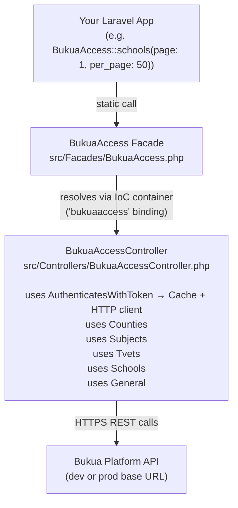
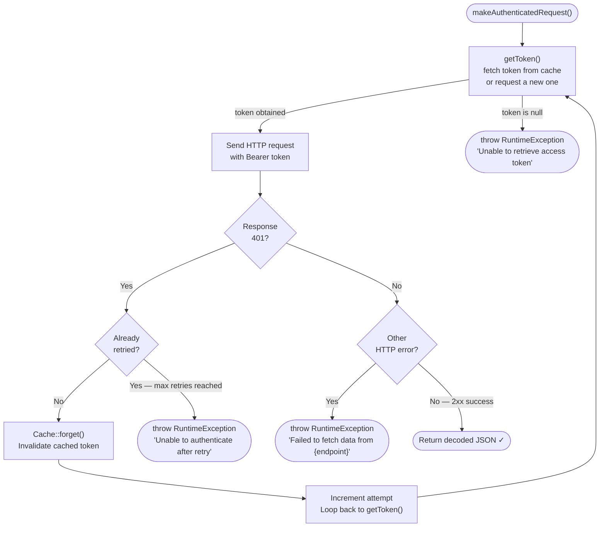
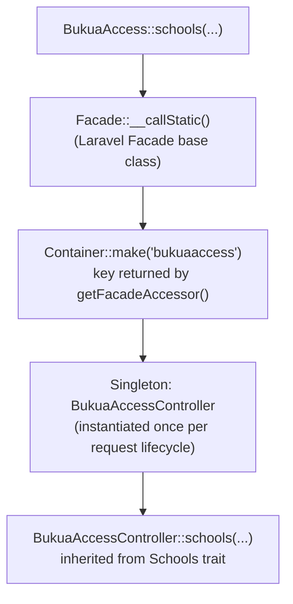

# Bukua Access — Mermaid Diagrams

Mermaid.js translations of every diagram found in [`concepts_onboarding.md`](./concepts_onboarding.md).

---

## Diagram 1 — High-Level Architecture (§3)

> How a call flows from your application through the Facade, into the controller, and out to the Bukua REST API.

---

## Diagram 2 — Automatic Token-Refresh on 401 (§6)

> The single-retry loop inside `makeAuthenticatedRequest()` that transparently handles a stale cached token.

---

## Diagram 3 — Facade Resolution Chain (§10)

> How a static Facade call resolves through the Laravel IoC container to the concrete singleton instance.

